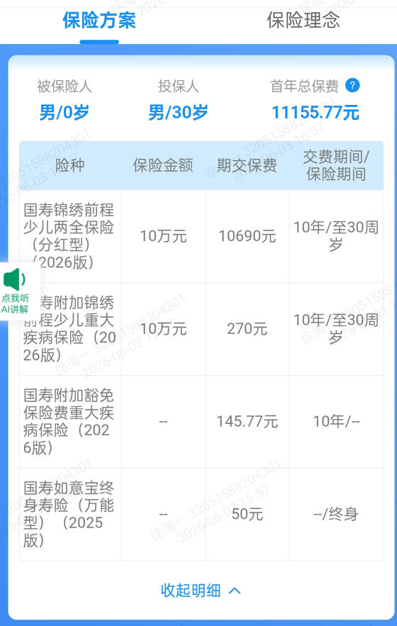

# 国寿锦绣前程少儿两全保险
## 保险方案

投保范围：28日以上，13周岁以下

保险期间：合同生效之日至30周岁的年生效对应日

交费方式：趸交/期交，期交为10年交或交至被保险人年满18周岁的年生效对应日

## 保险责任

### 1. 提供疾病保障
* 120种重大疾病，10万保额
* 40种轻度疾病，2万保额，限6次
* 20种特定疾病，5万保额，限2次
* 15种少儿疾病，10万保额

### 2. 提供身故/残疾保障
保费的1.6倍和现金价值的最大值

### 3. 生存给付
* 18周岁-21周岁，连续4年每年提供3000元教育金，总共12000元
* 22周岁-24周岁，连续3年每年给付5000元深造金，共计15000元
* 25周岁，给付立业金10000元
* 30周岁，给付满期保险金10万元

### 4. 保险豁免
重大疾病、身故、全残豁免保费

### 5. 提供个人账户价值，最低保证利率1%
### 6. 提供保单红利

